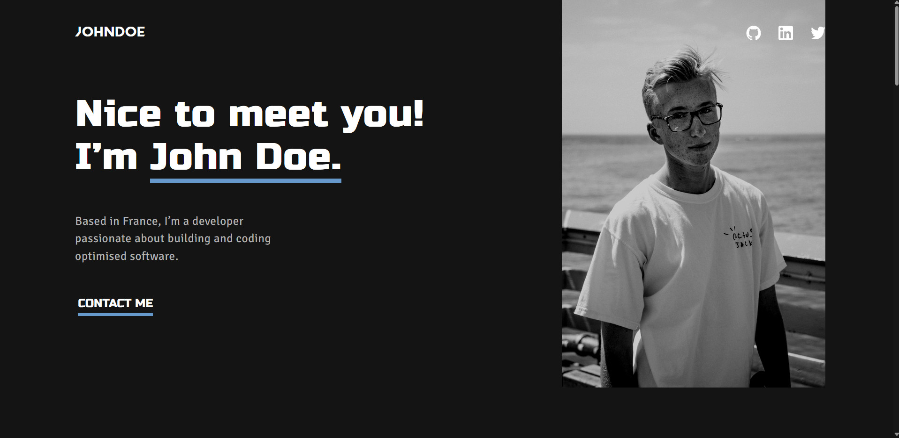

# Portfolio Template

I have created a reusable portfolio template using HTML and CSS with the Sass preprocessor. This template is designed for developers to showcase their projects, skills, and experiences in an elegant and professional manner. It utilizes modern web technologies like HTML5, CSS3 and is fully responsive, adapting to all types of devices including desktops, tablets, and smartphones. With this template, developers can easily customize the content, styles, and layout to fit their personal needs and preferences. The use of Sass allows for efficient and organized styling, making it easy to make changes and modifications to the design. Overall, this portfolio template provides a solid foundation for developers to create a professional portfolio and showcase their skills to potential employers and clients.

## Table of contents

- [Screenshot](#screenshot)
- [Built with](#built-with)
- [Useful resources](#useful-resources)
- [Author](#author)

### Screenshot

### Built with

- HTML5
- CSS3
- SASS

### Useful resources

- [MDN](https://developer.mozilla.org/fr/) - Use this site for HTML-CSS and JS resources.

## Author

- Github - [Nelo0o](https://github.com/Nelo0o)
- LinkedIn - [Léon Gallet](https://www.linkedin.com/in/léon-gallet)
